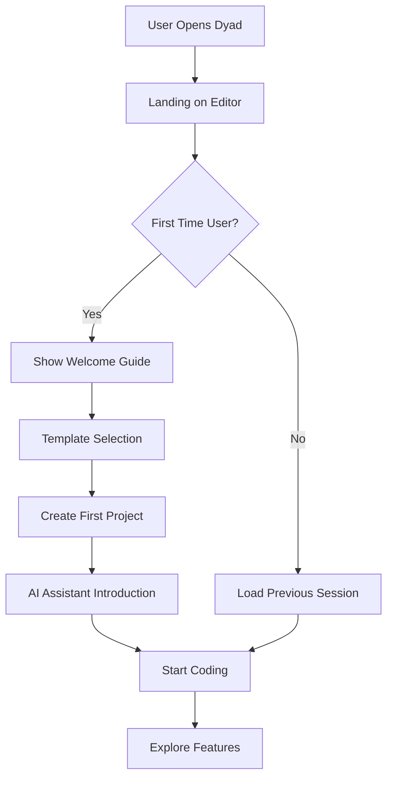
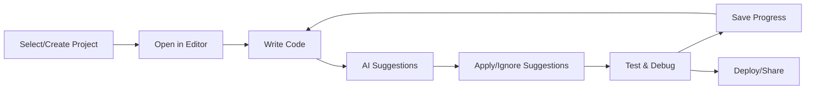
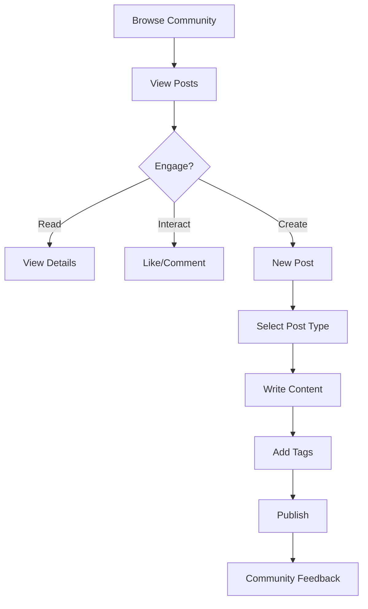

# Dyad AI App Builder - Site Navigation & User Journey Map

## Application Sitemap

```
Dyad AI App Builder
├── / (Root - redirects to /editor)
├── /editor (Main Development Environment)
│   ├── Code Editor Interface
│   ├── File Explorer Panel
│   ├── AI Assistant Panel
│   ├── Terminal Integration
│   ├── Minimap Navigation
│   ├── Debugger Tools
│   └── Performance Monitor
├── /templates (Project Templates)
│   ├── Template Gallery
│   ├── Category Filters
│   ├── Template Preview
│   └── Project Creation
├── /community (Developer Community)
│   ├── Community Feed
│   ├── Post Creation
│   ├── User Interactions
│   └── Content Filtering
├── /settings (Application Configuration)
│   ├── AI Assistant Settings
│   ├── Editor Preferences
│   ├── Theme Configuration
│   └── Community Settings
└── /404 (Error Page)
```

## User Journey Mapping

### 🚀 New User Onboarding Journey



**Steps:**
1. **Application Launch** → User opens Dyad application
2. **Environment Setup** → System loads development environment
3. **Project Initialization** → User selects template or creates new project
4. **AI Introduction** → Brief tour of AI assistance features
5. **Development Start** → User begins coding with AI support

### 💻 Primary Development Workflow



**Core Development Loop:**
1. **Project Selection** → Choose existing project or create from template
2. **Code Development** → Write code with syntax highlighting and AI assistance
3. **AI Interaction** → Receive and apply intelligent code suggestions
4. **Testing & Debugging** → Use integrated debugging tools and terminal
5. **Iteration** → Continuous improvement cycle with AI feedback

### 🤝 Community Engagement Journey



**Community Interaction Flow:**
1. **Discovery** → Browse community feed and trending posts
2. **Engagement** → Read, like, and comment on community content
3. **Contribution** → Create posts (contributions, questions, showcases)
4. **Feedback Loop** → Receive community responses and build reputation

## Page-Level Navigation Structure

### 🏠 Main Navigation (Sidebar)

| Route | Component | Purpose | Access Level |
|-------|-----------|---------|--------------|
| `/editor` | `Editor` | Primary development environment | All Users |
| `/templates` | `Templates` | Project template gallery | All Users |
| `/community` | `Community` | Developer community hub | All Users |
| `/settings` | `Settings` | Application preferences | All Users |

### 🔧 Editor Sub-Navigation

| Panel | Component | Toggle State | Default |
|-------|-----------|--------------|---------|
| File Explorer | `FileExplorer` | Collapsible | Open |
| AI Assistant | `AIPanel` | Collapsible | Open |
| Terminal | `Terminal` | Show/Hide | Hidden |
| Debugger | `DebuggerPanel` | Show/Hide | Hidden |
| Minimap | `Minimap` | Show/Hide | Visible |
| Performance Monitor | `PerformanceMonitor` | Show/Hide | Hidden |
| Code Snippets | `CodeSnippets` | Show/Hide | Hidden |

### 📱 Responsive Navigation Behavior

#### Desktop (≥ 1024px)
- Full sidebar navigation visible
- All panels available simultaneously
- Multi-panel layout with resizable sections

#### Tablet (768px - 1023px)
- Collapsible sidebar navigation
- Reduced panel count (priority panels only)
- Stacked layout for secondary panels

#### Mobile (< 768px)
- Hamburger menu navigation
- Single panel focus mode
- Bottom navigation for quick access

## User Personas & Navigation Patterns

### 👨‍💻 Professional Developer
**Primary Paths:**
- `/editor` → Code development with AI assistance
- `/templates` → Quick project initialization
- `/settings` → Customize development environment

**Navigation Behavior:**
- Keyboard shortcuts for efficiency
- Multiple panels open simultaneously
- Heavy use of AI suggestions and debugging tools

### 🎓 Learning Developer
**Primary Paths:**
- `/templates` → Explore pre-built examples
- `/community` → Learn from others' contributions
- `/editor` → Practice with AI guidance

**Navigation Behavior:**
- Step-by-step exploration
- Frequent use of AI explanations
- Community engagement for learning

### 🚀 Open Source Contributor
**Primary Paths:**
- `/community` → Share contributions and showcase work
- `/editor` → Develop and test contributions
- `/templates` → Create and share templates

**Navigation Behavior:**
- Active community participation
- Template creation and sharing
- Collaborative development patterns

## Accessibility Navigation

### Keyboard Navigation
- **Tab Order:** Logical tab sequence through all interactive elements
- **Skip Links:** Direct navigation to main content areas
- **Keyboard Shortcuts:** 
  - `Ctrl/Cmd + B` → Toggle sidebar
  - `Ctrl/Cmd + T` → Toggle terminal
  - `Ctrl/Cmd + P` → Open command palette
  - `Ctrl/Cmd + /` → Toggle AI assistant

### Screen Reader Support
- **ARIA Labels:** Comprehensive labeling for all interactive elements
- **Landmark Regions:** Proper semantic structure with navigation landmarks
- **Live Regions:** Dynamic content updates announced to screen readers
- **Focus Management:** Proper focus handling for modal dialogs and panels

### Visual Accessibility
- **High Contrast Mode:** Support for high contrast themes
- **Font Scaling:** Responsive to browser font size settings
- **Color Independence:** Information not conveyed by color alone
- **Focus Indicators:** Clear visual focus indicators for keyboard navigation

## Performance Considerations

### Route-Based Code Splitting
```typescript
// Lazy loading for optimal performance
const Editor = lazy(() => import('@/pages/editor'));
const Templates = lazy(() => import('@/pages/templates'));
const Community = lazy(() => import('@/pages/community'));
const Settings = lazy(() => import('@/pages/settings'));
```

### Navigation Performance Metrics
- **Time to Interactive (TTI):** < 3 seconds
- **First Contentful Paint (FCP):** < 1.5 seconds
- **Route Transition Time:** < 200ms
- **Panel Toggle Response:** < 100ms

## Error Handling & Fallbacks

### Navigation Error States
- **404 Not Found** → Custom error page with navigation suggestions
- **Network Errors** → Offline mode with cached navigation
- **Permission Errors** → Graceful degradation with available features
- **Loading States** → Skeleton screens and loading indicators

### Recovery Mechanisms
- **Auto-retry** → Automatic retry for failed navigation requests
- **Fallback Routes** → Alternative paths when primary routes fail
- **State Persistence** → Maintain user state across navigation errors
- **Error Reporting** → User-friendly error messages with actionable steps

## Analytics & User Behavior Tracking

### Navigation Analytics
- **Page Views** → Track most visited sections
- **User Flow** → Analyze common navigation patterns
- **Feature Usage** → Monitor panel and tool utilization
- **Drop-off Points** → Identify where users leave the application

### Performance Monitoring
- **Navigation Timing** → Measure route transition performance
- **Panel Load Times** → Track component initialization speed
- **User Interaction Metrics** → Monitor engagement with navigation elements
- **Error Rates** → Track navigation-related errors and failures

This sitemap provides a comprehensive overview of the Dyad AI App Builder's navigation structure, user journeys, and accessibility considerations, enabling developers to understand the complete user experience and navigation flow.